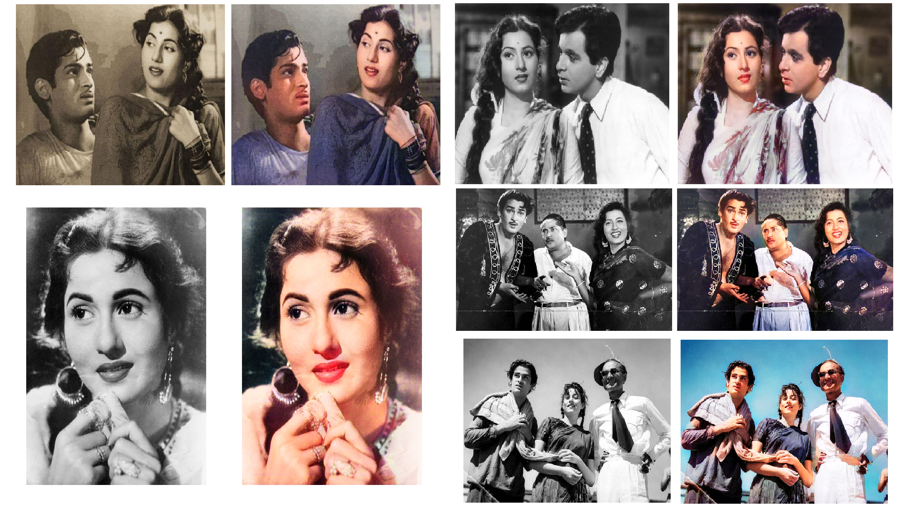

# Deep-Learning-with-GoogleColab
Develop Deep Learning Applications with Google Colaboratory - on the free Tesla K80/Tesla T4/Tesla P100 GPU - using Keras, Tensorflow and PyTorch.

**Darknet YOLOv4 - Google Colab (Firearms Detection)**
---
Firearms Detection .ipynb)

Darknet YOLOv4: Real-Time Object Detection

You only look once (YOLOv4) is a state-of-the-art, real-time Firearms detection system for firearms, pistol, rifle detection.

Youtube Link: 
https://youtu.be/XgvDXT0fme4

**Cigarette/Smoking Detection using YOLOv3 Darknet**
---
Cigarette/Smoking Detection 

YOLO: Real-Time Object Detection

You only look once (YOLO) is a state-of-the-art, real-time object detection system for cigarette & smoking detection.

Youtube Link: 
https://youtu.be/vEnQIptZzyI

**Guns Detection using YOLOv3 Darknet**
---
Guns Detection 

YOLO: Real-Time Object Detection

You only look once (YOLO) is a state-of-the-art, real-time object detection system for firearms, pistol, rifle detection.

Youtube Link: 
https://youtu.be/Uzty5hRWSQs

<b>Note:</b>
+ Why some guns were not detected?
  - I had few images of a pistol, when I trained the Yolo model.
  

**Pyannote-Video**
---
Pyannote-Video 

<b>A Toolkit for Face Detection, Tracking, and Clustering in Videos</b>

Youtube Link: 
https://youtu.be/8hepsfDWzFA

**DeOldify**
---
Image  |
Video 

<b>To Colorizing and Restoring your old Black and White Photos/Videos</b>

Youtube Channel Link: 
https://www.youtube.com/channel/UC0L-Z0hP3_39dSNNNgpdiOQ

**Acknowledgements**
---

+ [@pjreddie](https://www.github.com/pjreddie) for Original Darknet(YOLOv3) Version.
+ [@AlexeyAB](https://www.github.com/AlexeyAB) for Modify Darknet(YOLOv3) Version.
+ [@pyannote](https://www.github.com/pyannote) for pyannote-video.
+ [@jantic](https://github.com/jantic) for DeOldify.
